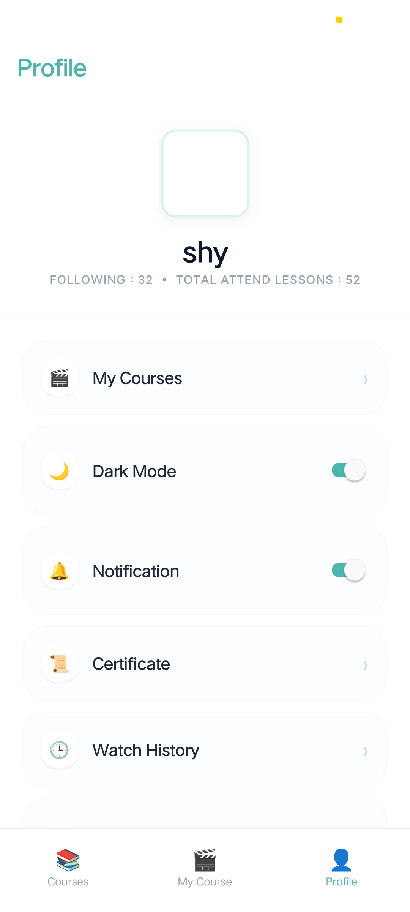
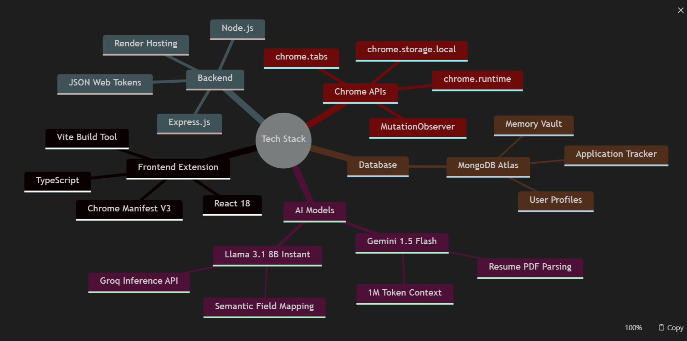
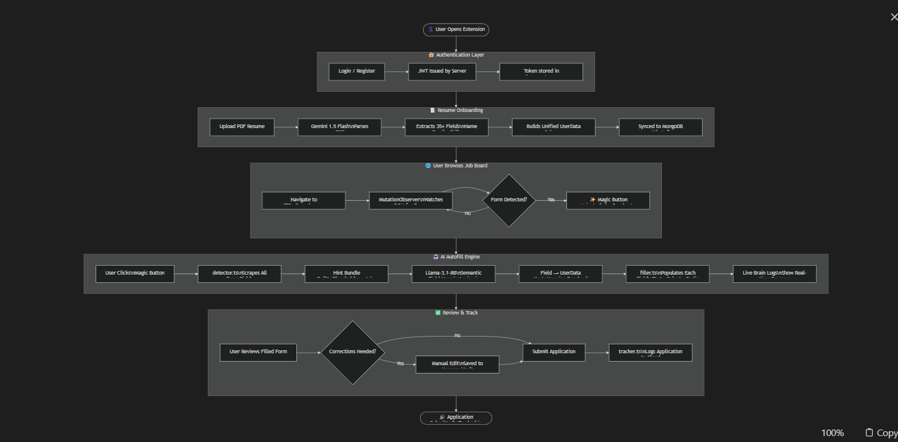
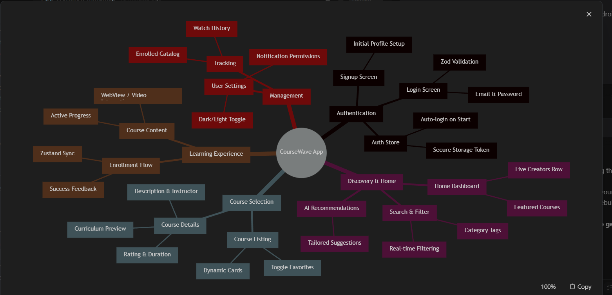

# CourseWave — Mini LMS App

A full-featured Mini LMS mobile application built with React Native Expo. Designed and architected as a technical assignment.

## 📱 App Preview & Demo

### Application Interface


### Working Demonstration
*(If your viewer supports video, you can see the app in action below)*

https://github.com/code0era/MINI_LMS_APP/raw/main/doc/rec.mp4

---

## 🚀 Key Features

1. **Authentication:** Secure JWT-based login/register using `api.freeapi.app`, with tokens safely stored in `expo-secure-store`.
2. **Course Catalog:** Dynamic data merging with infinite scroll using `@legendapp/list`.
3. **Interactive Player:** Custom bridge for module completion tracking and video simulation.
4. **Offline-First:** Local caching with automatic connectivity detection banners.
5. **Modern Styling:** Premium dark mode support (grayish tones) using NativeWind v4.
6. **AI Recommendations:** Groq API (Llama 3) integration for personalized course discovery.

## 🛠 Tech Stack

- **Framework:** React Native Expo (SDK 52+)
- **Styling:** NativeWind (Tailwind CSS v4)
- **State Management:** Zustand
- **Networking:** Axios
- **Form Validation:** React Hook Form + Zod
- **List Rendering:** `@legendapp/list`

## 🖼️ Application Flow & Documentation

Below are the architectural diagrams and workflow visualizations for the CourseWave application:

### 1. System Logic & Architecture


### 2. End-to-End Workflow


### 3. Application State & Data Flow


### 4. Component Structure


### 5. Full Feature Roadmap


## 📦 Local Setup (Step-by-Step)

### 1. Clone & Install
```powershell
git clone https://github.com/code0era/MINI_LMS_APP.git
cd MINI_LMS_APP
npm install
```

### 2. The "Worklets Shim" Fix (CRITICAL)
Due to a known dependency mismatch in SDK 52 for some environments, you **must** create a directory junction to link the legacy worklets name to the newer core package. 

**Run this in a PowerShell terminal (Administrator recommended):**
```powershell
cmd /c mklink /j node_modules\react-native-worklets node_modules\react-native-worklets-core
```
*Note: If you are on Mac/Linux, use: `ln -s react-native-worklets-core node_modules/react-native-worklets`*

### 3. Environment Config
Rename `.env.example` to `.env` and add your keys. 
`EXPO_PUBLIC_API_BASE_URL` is required for the app to function.

### 4. Start the App
Always start with the clear-cache flag to ensure Babel configurations are picked up correctly:
```bash
npx expo start -c
```

## 🏗 Build Instructions

### Generate Android APK
To generate a standalone APK that can be installed on any device:
```bash
npx eas build -p android --profile production
```
*When prompted, select **"Y"** to generate a new Keystore. The build will take ~10 minutes on the Expo cloud.*

## 📝 Project Structure
- `/app`: Expo Router screens and layouts.
- `/src/components`: UI components and design system.
- `/src/store`: Zustand state management.
- `/src/api`: Axios networking and data normalization.
- `/assets`: Static images and thumbnails.

---
*Built as a technical assignment submission.*
